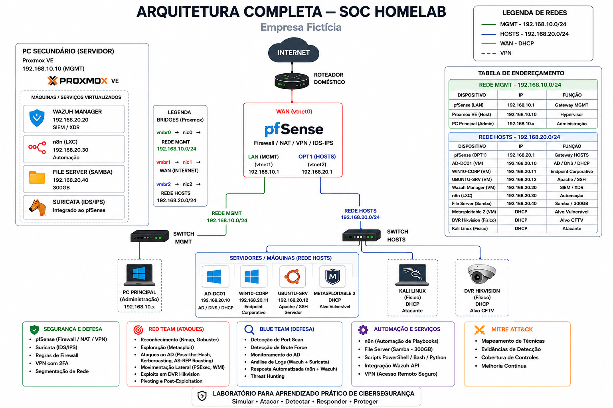

# 🛡️ Projeto Homelab SOC — Empresa Fictícia

> Ambiente de laboratório doméstico para simulação de um ambiente corporativo real, focado em prática de Blue Team, Red Team e operações de SOC.

---



## 📌 Sobre o Projeto

Este projeto documenta a construção completa de um **Home Lab de Cibersegurança**, simulando o ambiente de TI de uma empresa fictícia — com firewall perimetral, segmentação de rede, Active Directory, endpoints, SIEM, IDS/IPS, automação de resposta a incidentes e um conjunto de alvos vulneráveis para exercícios ofensivos.

O objetivo é aprender na prática como ataques acontecem e como um SOC detecta, investiga e responde a incidentes, seguindo o framework **MITRE ATT&CK**.

---

## 🖥️ Inventário de Hardware

| Máquina | Papel | Especificações |
|---|---|---|
| **PC Secundário** (Servidor) | Infraestrutura de segurança — Proxmox VE | Intel i5 / 16GB RAM / 2TB HD / 3x NICs |
| **PC Principal** | Ambiente corporativo — VMware Workstation Pro | AMD Ryzen 5 4600G / 16GB RAM / 500GB SSD + 500GB HD |
| **Notebook** | Atacante — Kali Linux | Intel i3 / 4GB RAM / 500GB HD |
| **DVR Hikvision** | Alvo CFTV vulnerável | 8 canais |

---

## 🌐 Arquitetura de Rede

```
INTERNET
    │
ROTEADOR DOMÉSTICO
    │
┌───────────────────────────────────────────┐
│         PC SECUNDÁRIO — Proxmox VE        │
│                                           │
│  ┌─────────────────────────────────────┐  │
│  │          VM: fw-pfsense             │  │
│  │   WAN   → vtnet0 → vmbr1 → nic1    │  │
│  │   LAN   → vtnet1 → vmbr0 → nic0    │  │
│  │   OPT1  → vtnet2 → vmbr2 → nic2    │  │
│  └─────────────────────────────────────┘  │
│  VM: Wazuh Manager  (192.168.20.20)       │
│  LXC: n8n           (192.168.20.30)       │
│  LXC: File Server   (192.168.20.40)       │
│  Suricata: IDS/IPS                        │
└───────────────────────────────────────────┘
        │                       │
   REDE — MGMT             REDE — HOSTS
 192.168.10.0/24        192.168.20.0/24
         │                      │
   Switch MGMT            Switch HOSTS
        │                       |
   PC Principal         ┌───────────────┐
  (Administrator)       │ DVR Hikvision │ 192.168.20.50
                        │ Kali Linux    │ 192.168.20.x
                        └───────────────┘
                                |
                          PC Principal
                      (VMware Workstation)
                                |                      
                        ┌───────────────┐
                        │ AD-DC01       │ 192.168.20.10
                        │ WIN10-CORP    │ 192.168.20.11
                        │ UBUNTU-SRV    │ 192.168.20.12
                        │ METASPLOITABLE│ 192.168.20.x
                        └───────────────┘

```

### Tabela de endereçamento

| Dispositivo | Rede | IP | Função |
|---|---|---|---|
| Proxmox VE (host) | MGMT | `192.168.10.10` | Hypervisor |
| pfSense — LAN | MGMT | `192.168.10.1` | Gateway MGMT |
| pfSense — OPT1 | HOSTS | `192.168.20.1` | Gateway HOSTS |
| AD-DC01 | HOSTS | `192.168.20.10` | AD / DNS / DHCP |
| WIN10-CORP | HOSTS | `192.168.20.11` | Endpoint corporativo |
| UBUNTU-SRV | HOSTS | `192.168.20.12` | Apache / SSH |
| Wazuh Manager | HOSTS | `192.168.20.20` | SIEM / XDR |
| n8n | HOSTS | `192.168.20.30` | Automação |
| File Server | HOSTS | `192.168.20.40` | Samba / 300GB |
| Metasploitable 2 | HOSTS | DHCP | Alvo pentest |
| DVR Hikvision | HOSTS | `192.168.20.50` | Alvo CFTV |
| Kali Linux | HOSTS | DHCP | Atacante |

---

## 🛠️ Pilha de Tecnologia

| Ferramenta | Função |
|---|---|
| **Proxmox VE** | Hypervisor bare-metal (PC Secundário) |
| **pfSense** | Firewall / NAT / VPN / Suricata (IDS/IPS) |
| **Suricata** | IDS/IPS inline integrado ao pfSense |
| **Wazuh** | SIEM / XDR — coleta, correlação e resposta |
| **Sysmon** | Telemetria avançada nos endpoints Windows |
| **Active Directory** | Gestão de identidade e políticas (GPOs) |
| **n8n** | Automação de playbooks e resposta a incidentes |
| **Samba** | File server com 300GB para logs e evidências |
| **VMware Workstation Pro** | Hypervisor do ambiente corporativo |
| **Kali Linux** | Plataforma de testes ofensivos |

---

## 🗺️ Fases de Construção

| Fase | Descrição | Status |
|---|---|---|
| [Fase 1](docs/fase1/README.md) | Proxmox VE + pfSense + Segmentação de Rede | ✅ Concluída |
| [Fase 2](docs/fase2/README.md) | Ambiente Corporativo — AD, Windows 10, Ubuntu e Metasploitable| ✅ Concluída |
| [Fase 3](docs/fase3/README.md) | Wazuh Manager + Agentes + Suricata | ✅ Concluída |
| [Fase 4](docs/fase4/README.md) | Automação (n8n) + File Server + VPN | ✅ Concluída |
| [Fase 5](docs/fase5/README.md) | DVR Hikvision | ✅ Concluída |

---

## 🧪 Laboratórios Práticos

### 🔴 Red Team (`labs/redteam/`)

| Lab | Técnica | MITRE ATT&CK |
|---|---|---|
| Reconhecimento de rede | Nmap, Gobuster | T1046 — Network Service Discovery |
| Exploração do Metasploitable | Metasploit Framework | T1190 — Exploit Public-Facing Application |
| Ataques ao Active Directory | Pass-the-Hash, Kerberoasting, AS-REP Roasting | T1558, T1550 |
| Movimentação lateral | PsExec, WMI | T1021 |
| Exploração do DVR Hikvision | CVEs de CFTV | T1190 |
| Pivoting | Kali → rede interna | T1572 |

### 🔵 Blue Team (`labs/blueteam/`)

| Lab | Ferramenta | Objetivo |
|---|---|---|
| Detecção de port scan | Suricata + Wazuh | Identificar reconhecimento |
| Detecção de brute force | Wazuh | Alertar tentativas de login |
| Monitoramento do AD | Wazuh + Sysmon | Detectar criação de usuários suspeitos |
| Análise de logs Suricata | Wazuh Dashboard | Investigar tráfego malicioso |
| Resposta automatizada | n8n + Wazuh | Bloquear IP atacante automaticamente |
| Threat Hunting | Wazuh | Identificar comportamento anômalo |

### 🎯 MITRE ATT&CK (`labs/mitre/`)

Mapeamento de cada ataque executado no lab com as táticas e técnicas do framework MITRE ATT&CK, incluindo evidências de detecção (ou não detecção) pelo Wazuh/Suricata.

---

## 📁 Estrutura do Repositório

```
projeto-ciberseguranca/
├── README.md                        ← este arquivo
├── assets/                          ← imagens gerais (arquitetura, topologia)
├── docs/
│   ├── fase1/
│   │   ├── README.md                ← Proxmox + pfSense
│   │   └── assets/                  ← prints da fase 1
│   ├── fase2/
│   │   ├── README.md                ← Ambiente corporativo
│   │   └── assets/                  ← prints da fase 2
│   ├── fase3/
│   │   ├── README.md                ← Wazuh + Suricata
│   │   └── assets/
│   ├── fase4/
│   │   ├── README.md                ← n8n + File Server + VPN
│   │   └── assets/
│   └── fase5/
│       ├── README.md                ← DVR + Docker + Labs avançados
│       └── assets/
└── labs/
    ├── redteam/                     ← cenários ofensivos
    ├── blueteam/                    ← detecção e resposta
    └── mitre/                       ← mapeamento MITRE ATT&CK
```

---

## 🎯 Objetivo Final

Simular o ciclo completo de segurança de uma empresa fictícia:

```
ATAQUE → DETECÇÃO → INVESTIGAÇÃO → RESPOSTA → DOCUMENTAÇÃO
```

Usando ferramentas e processos reais de mercado, mapeados ao framework MITRE ATT&CK, gerando evidências documentadas para portfólio profissional.

---

## ⚠️ Aviso Legal

Este ambiente é construído exclusivamente para fins educacionais em hardware próprio e em rede isolada. Nenhuma técnica documentada aqui deve ser aplicada contra sistemas, redes ou dispositivos sem autorização explícita e por escrito do proprietário.

---

## 👨‍💻 Autor

Matheus Dantas

- Tecnólogo em Cibersegurança
- CompTIA Security+
- DCPT

Objetivo profissional: Security Operations Center (SOC)

> *"Na prática, a melhor forma de aprender é testar, detectar, responder e evoluir sempre."*
