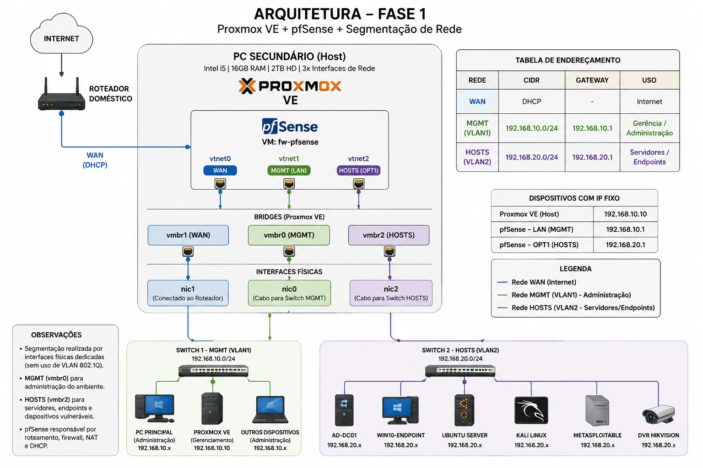
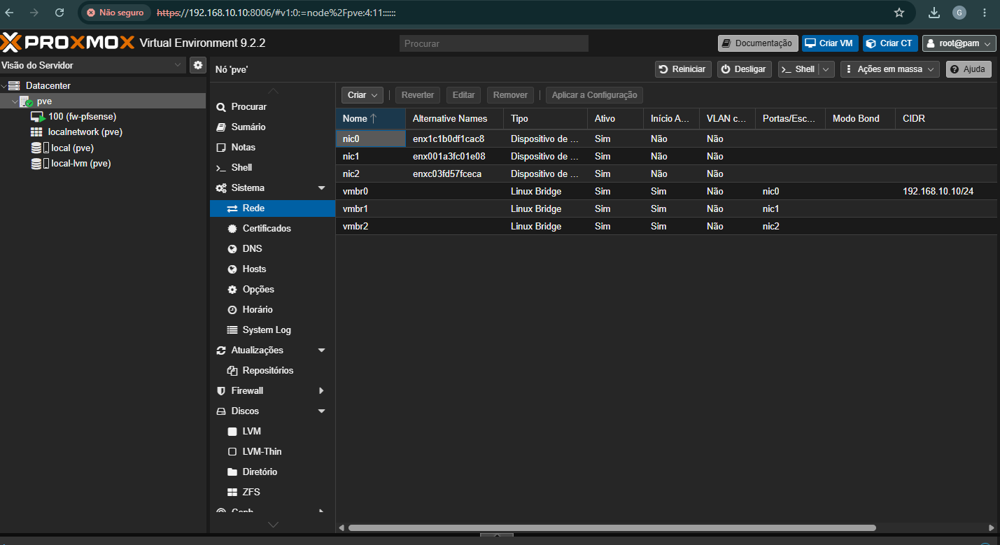
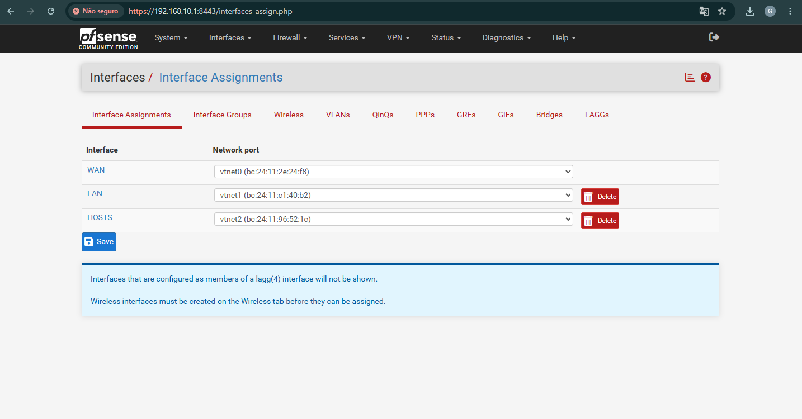
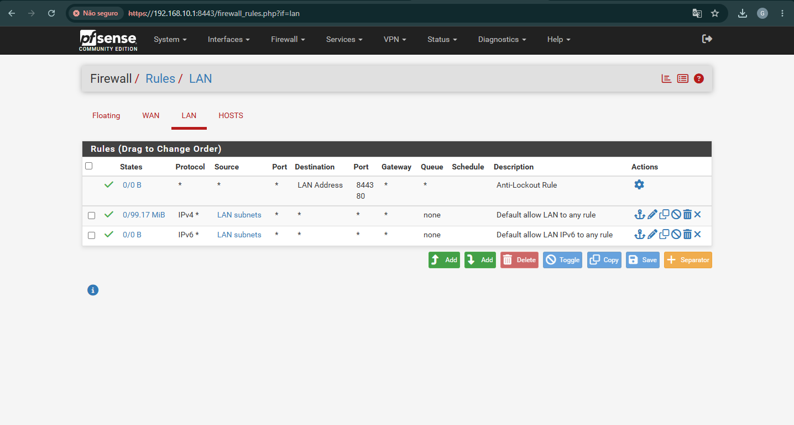
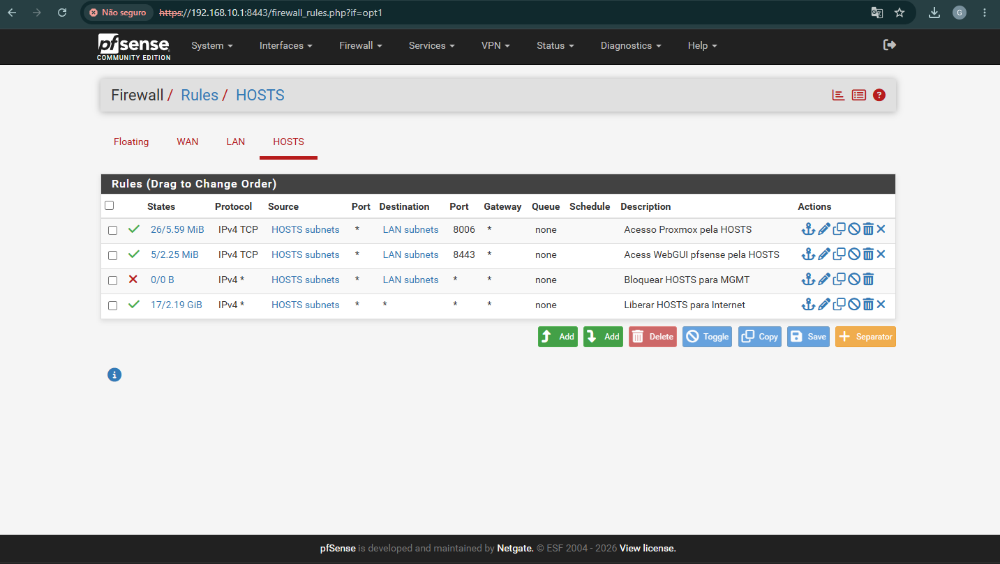
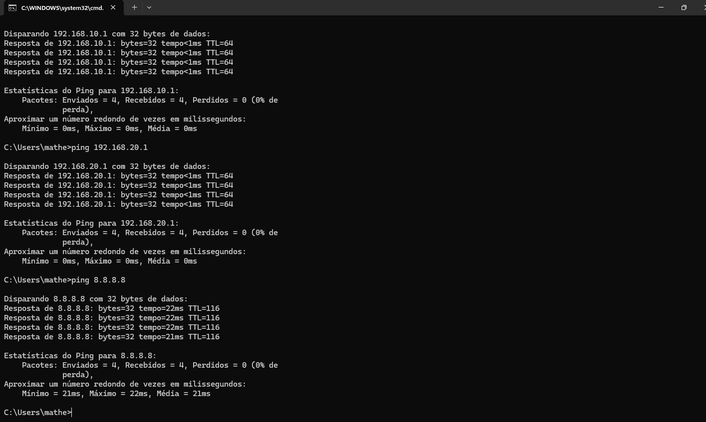

# 🔐 Fase 1 — Infraestrutura de Rede e Segmentação

> **Status:** ✅ Concluída  
> **Hardware:** PC Secundário (Intel i5 · 16 GB RAM · 2 TB HD · 3 interfaces de rede)  
> **Objetivo:** Implementar a infraestrutura base do laboratório de cibersegurança utilizando Proxmox VE e pfSense, com segmentação entre redes administrativas e operacionais.

---

## 📋 Índice

- [Resumo](#-resumo)
- [Arquitetura da Solução](#1-arquitetura-da-solução)
- [Endereçamento](#2-endereçamento)
- [Instalação do Proxmox VE](#3-instalação-do-proxmox-ve)
- [Configuração dos Bridges](#4-configuração-dos-bridges)
- [Implantação do pfSense](#5-implantação-do-pfsense)
- [Configuração das Redes](#6-configuração-das-redes)
- [Firewall e Segmentação](#7-firewall-e-segmentação)
- [Validação](#8-validação)
- [Problemas Encontrados](#9-problemas-encontrados)
- [Lições Aprendidas](#10-lições-aprendidas)
- [Conclusão](#11-conclusão)

---

## 📝 Resumo

Nesta fase foi implementada a infraestrutura fundamental do laboratório de cibersegurança, com foco em virtualização, firewall e segmentação de rede.

**Objetivos alcançados:**

| # | Objetivo |
|---|----------|
| ✅ | Virtualização com Proxmox VE |
| ✅ | Firewall virtualizado com pfSense |
| ✅ | Segmentação das redes MGMT e HOSTS |
| ✅ | Configuração de DHCP e NAT |
| ✅ | Controle de acesso entre segmentos |
| ✅ | Validação da conectividade e isolamento de rede |

> Esta infraestrutura serve como base para as próximas fases do projeto, incluindo Active Directory, Wazuh, Suricata, automação, Blue Team e Red Team.

---

## 1. Arquitetura da Solução

A infraestrutura foi construída utilizando um host Proxmox dedicado, responsável pela virtualização do firewall pfSense.



```
                        ┌─────────────────────────────────────────┐
                        │            HOST PROXMOX VE               │
                        │          192.168.10.10 (MGMT)            │
                        │                                          │
   [ Internet ]         │  ┌──────────────────────────────────┐   │
        │               │  │         VM — fw-pfsense           │   │
     (WAN)              │  │   2 vCPU · 2 GB RAM · 20 GB HD   │   │
      nic1 ─────────────┼──┤ WAN (vmbr1)                       │   │
                        │  │ LAN/MGMT (vmbr0) ─ 192.168.10.1  │   │
      nic0 ─────────────┼──┤ OPT1/HOSTS (vmbr2) ─ 192.168.20.1│  │
  [Rede MGMT]           │  └──────────────────────────────────┘   │
                        │                                          │
      nic2 ─────────────┼──── [Rede HOSTS]                        │
  [Rede HOSTS]          │                                          │
                        └─────────────────────────────────────────┘
```

**Interfaces físicas utilizadas:**

| Interface | Função |
|-----------|--------|
| `nic0` | Rede MGMT |
| `nic1` | WAN |
| `nic2` | Rede HOSTS |

> A segmentação foi realizada utilizando interfaces físicas dedicadas, sem utilização de VLAN 802.1Q.

---

## 2. Endereçamento

### Redes

| Rede | CIDR | Gateway |
|------|------|---------|
| WAN | DHCP | Roteador doméstico |
| MGMT | `192.168.10.0/24` | `192.168.10.1` |
| HOSTS | `192.168.20.0/24` | `192.168.20.1` |

### Endereços Fixos

| Equipamento | Endereço IP |
|-------------|-------------|
| Proxmox VE | `192.168.10.10` |
| pfSense — Interface MGMT | `192.168.10.1` |
| pfSense — Interface HOSTS | `192.168.20.1` |

---

## 3. Instalação do Proxmox VE

A instalação do Proxmox VE foi realizada diretamente no host físico com as seguintes configurações:

| Parâmetro | Valor |
|-----------|-------|
| Hostname | `pve.homelab.local` |
| IP | `192.168.10.10` |
| Gateway | `192.168.10.1` |
| DNS | `1.1.1.1` |

Após a instalação, o acesso foi validado pela interface Web do Proxmox.

---

## 4. Configuração dos Bridges

Foram criados três bridges Linux para isolar e segmentar as redes do ambiente:

| Bridge | Interface Física | Função |
|--------|-----------------|--------|
| `vmbr0` | `nic0` | MGMT |
| `vmbr1` | `nic1` | WAN |
| `vmbr2` | `nic2` | HOSTS |

> 

---

## 5. Implantação do pfSense

Uma máquina virtual dedicada foi criada para atuar como firewall principal do ambiente.

### Configuração da VM

| Parâmetro | Valor |
|-----------|-------|
| Nome | `fw-pfsense` |
| CPU | 2 vCPU |
| RAM | 2 GB |
| Disco | 20 GB |
| Sistema | pfSense CE |

### Mapeamento de Interfaces

| Interface pfSense | Bridge Proxmox | Rede |
|-------------------|---------------|------|
| WAN | `vmbr1` | Internet |
| LAN (MGMT) | `vmbr0` | `192.168.10.0/24` |
| OPT1 (HOSTS) | `vmbr2` | `192.168.20.0/24` |

---

## 6. Configuração das Redes

### Rede MGMT

| Parâmetro | Valor |
|-----------|-------|
| Rede | `192.168.10.0/24` |
| Gateway | `192.168.10.1` |
| DHCP | `192.168.10.100` – `192.168.10.199` |

### Rede HOSTS

| Parâmetro | Valor |
|-----------|-------|
| Rede | `192.168.20.0/24` |
| Gateway | `192.168.20.1` |
| DHCP | `192.168.20.100` – `192.168.20.199` |

> 

---

## 7. Firewall e Segmentação

O objetivo principal da segmentação é separar os dispositivos administrativos dos dispositivos utilizados em laboratórios e testes.

### Regras — Rede MGMT

A rede MGMT possui acesso administrativo completo aos serviços de infraestrutura, incluindo o painel do Proxmox e o pfSense.

> 

### Regras — Rede HOSTS

A rede HOSTS tem acesso à internet, porém é bloqueada de acessar livremente a rede administrativa.

| Regra | Ação |
|-------|------|
| Saída para internet | ✅ Permitido |
| Acesso direto à rede MGMT | ❌ Bloqueado |
| Acessos administrativos específicos | ⚠️ Permitido quando necessário |

> 

---

## 8. Validação

Foram realizados testes de conectividade para validar o funcionamento do ambiente.

### Testes — Rede MGMT

| Teste | Resultado |
|-------|-----------|
| Acesso ao Proxmox VE | ✅ OK |
| Acesso ao pfSense (WebGUI) | ✅ OK |
| Conectividade com internet | ✅ OK |

### Testes — Rede HOSTS

| Teste | Resultado |
|-------|-----------|
| Acesso ao gateway local | ✅ OK |
| Conectividade com internet | ✅ OK |
| Bloqueio de acesso à rede MGMT | ✅ Bloqueado conforme esperado |

### Resultado Geral

| Componente | Status |
|------------|--------|
| NAT | ✅ Operacional |
| DHCP | ✅ Operacional |
| Comunicação inter-redes (controlada) | ✅ Operacional |
| Acesso externo | ✅ Operacional |
| Isolamento HOSTS → MGMT | ✅ Validado |

> 

---

## 9. Problemas Encontrados

### 🔴 ISO não disponível no Proxmox

| Campo | Detalhe |
|-------|---------|
| **Problema** | A ISO do pfSense não aparecia durante a criação da VM |
| **Causa** | ISO não havia sido enviada ao storage do Proxmox |
| **Solução** | Upload manual da imagem ISO via interface Web |

---

### 🔴 Falha durante instalação do pfSense

| Campo | Detalhe |
|-------|---------|
| **Problema** | Mensagem de falha durante o processo de instalação |
| **Causa** | Instabilidade pontual do processo |
| **Solução** | Reinstalação completa da VM |

---

### 🔴 Boot retornando para o instalador

| Campo | Detalhe |
|-------|---------|
| **Problema** | Sistema reiniciava sempre no instalador |
| **Causa** | ISO permanecia montada na unidade virtual após instalação |
| **Solução** | Remoção da mídia e ajuste da ordem de boot |

---

### 🔴 Falha de acesso à internet na rede HOSTS

| Campo | Detalhe |
|-------|---------|
| **Problema** | Dispositivos da rede HOSTS sem saída para internet |
| **Causa** | Regras de firewall ausentes na interface OPT1 |
| **Solução** | Criação das regras de saída e validação do NAT automático |

---

## 10. Lições Aprendidas

Durante esta fase foram consolidados conhecimentos nas seguintes áreas:

| Área | Tópicos |
|------|---------|
| **Virtualização** | Proxmox VE, bridges Linux, gerenciamento de VMs |
| **Firewall** | pfSense CE, regras de segmentação, interfaces WAN/LAN/OPT |
| **Redes** | NAT, roteamento, DHCP, endereçamento IP |
| **Troubleshooting** | Diagnóstico de conectividade, ordem de boot, montagem de mídia |
| **Segurança** | Controle de acesso entre segmentos, isolamento de redes |

> A implementação permitiu compreender em profundidade o fluxo de tráfego entre redes isoladas e o funcionamento de um firewall corporativo em ambiente virtualizado.

---

## 11. Conclusão

A Fase 1 estabeleceu com sucesso a infraestrutura base do laboratório de cibersegurança.

**Resultados alcançados:**

- Virtualização de serviços com Proxmox VE
- Firewall corporativo implementado com pfSense CE
- Segmentação efetiva entre redes administrativas (MGMT) e operacionais (HOSTS)
- Conectividade segura garantida via NAT e regras de firewall
- Isolamento entre segmentos validado e documentado

---

### ➡️ Próxima Fase

**Fase 2 — Ambiente Corporativo**

> Active Directory · Windows 10 · Ubuntu Server · Metasploitable

