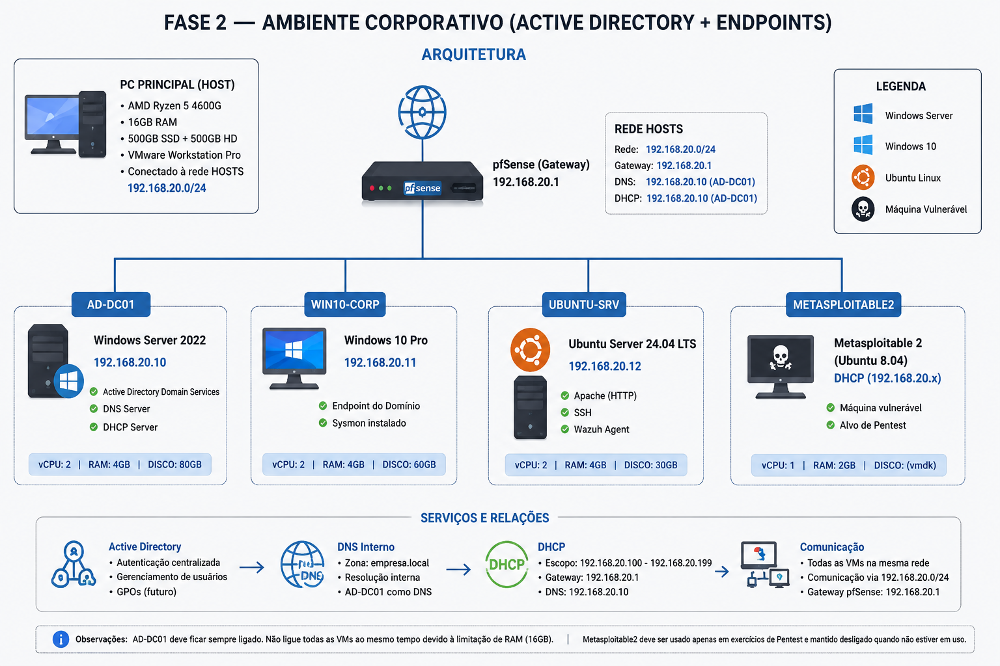
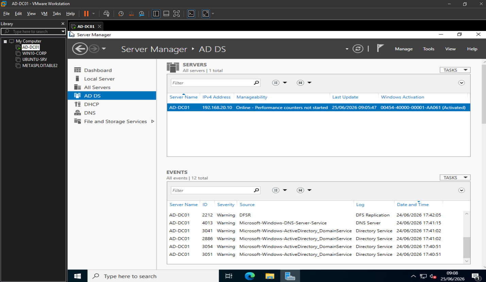
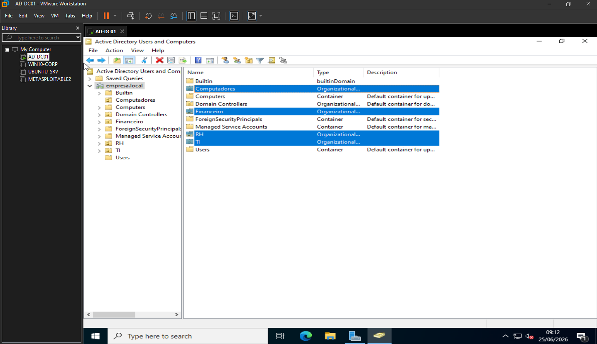
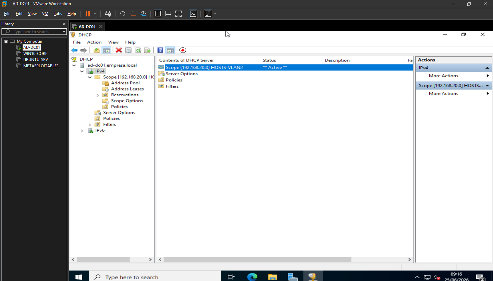
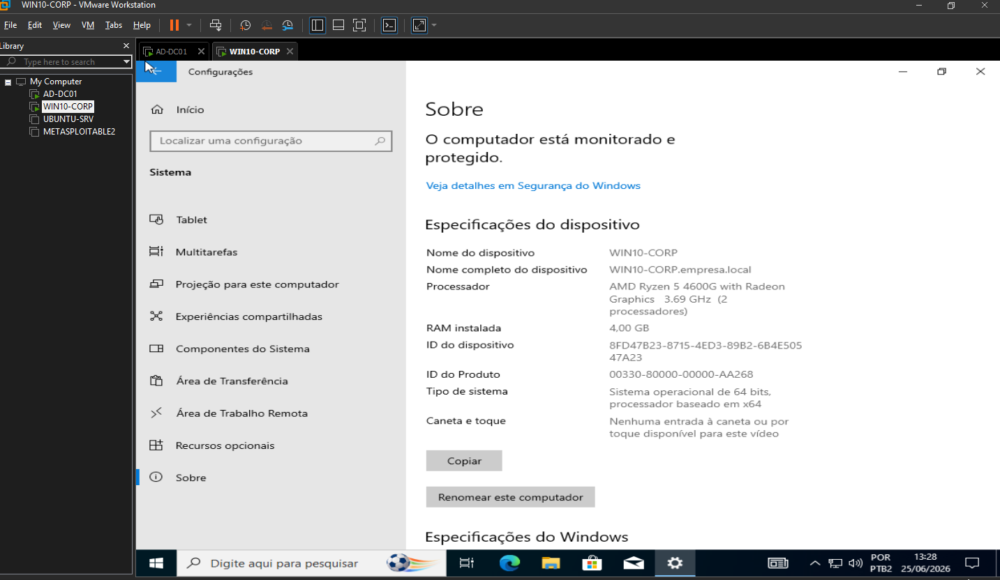
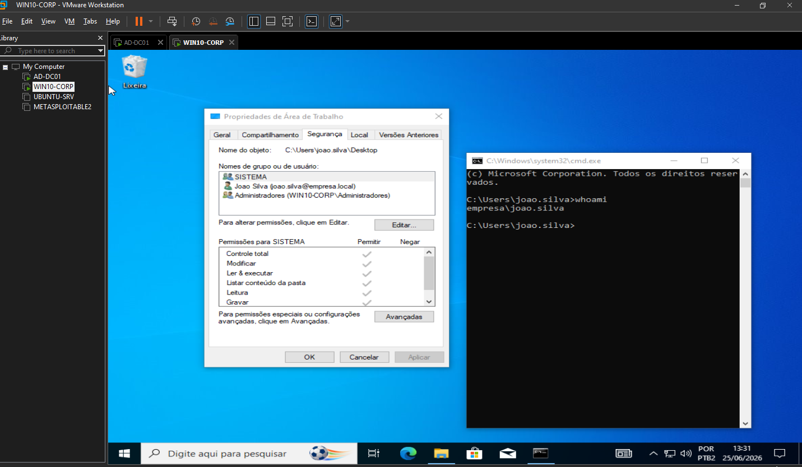
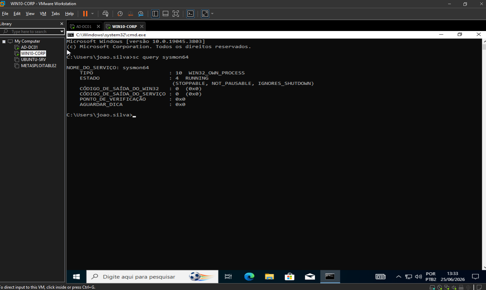
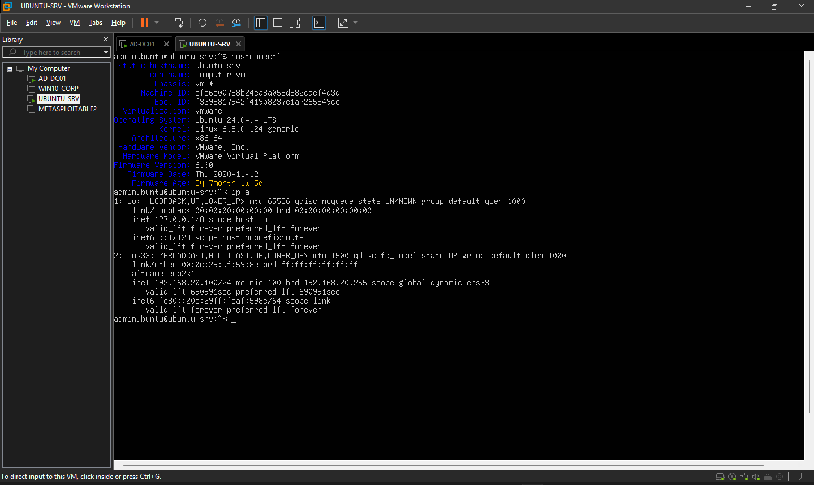
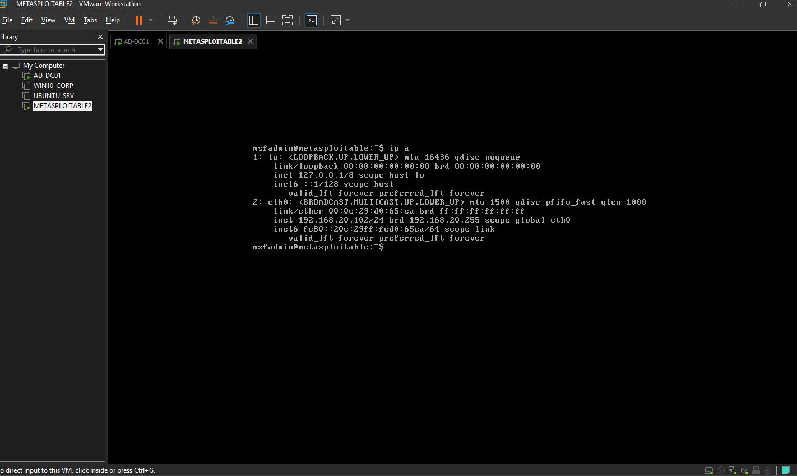

# Fase 2 — Ambiente Corporativo (Active Directory + Endpoints)

> **Status:** ✅ Concluída  
> **Hardware:** PC Principal (AMD Ryzen 5 4600G, 16GB RAM, 500GB SSD + 500GB HD)  
> **Hypervisor:** VMware Workstation Pro  
> **Objetivo:** Criar o ambiente corporativo fictício com Active Directory, endpoints Windows e Linux, e um alvo vulnerável para pentest.

---

## Índice

1. [Arquitetura da Fase 2](#1-arquitetura-da-fase-2)
2. [Pré-requisitos](#2-pré-requisitos)
3. [Configuração do VMware Workstation Pro](#3-configuração-do-vmware-workstation-pro)
4. [VM AD-DC01 — Windows Server 2022](#4-vm-ad-dc01--windows-server-2022)
5. [Active Directory — OUs e Usuários](#5-active-directory--ous-e-usuários)
6. [DHCP no AD-DC01](#6-dhcp-no-ad-dc01)
7. [VM WIN10-CORP — Windows 10](#7-vm-win10-corp--windows-10)
8. [Entrar no domínio](#8-entrar-no-domínio)
9. [Sysmon no WIN10-CORP](#9-sysmon-no-win10-corp)
10. [VM UBUNTU-SRV — Ubuntu Server 24.04](#10-vm-ubuntu-srv--ubuntu-server-2404)
11. [VM METASPLOITABLE2](#11-vm-metasploitable2)
12. [Testes de validação](#12-testes-de-validação)
13. [Problemas encontrados e soluções](#13-problemas-encontrados-e-soluções)
14. [Checklist de prints](#14-checklist-de-prints)

---

## 1. Arquitetura da Fase 2


```
REDE HOSTS — 192.168.20.0/24 (gateway: 192.168.20.1 — pfSense)
│
├── 192.168.20.10  AD-DC01        (Windows Server 2022 — AD/DNS/DHCP)
├── 192.168.20.11  WIN10-CORP     (Windows 10 Pro — endpoint do domínio)
├── 192.168.20.12  UBUNTU-SRV     (Ubuntu Server 24.04 — Apache/SSH)
└── 192.168.20.1xx METASPLOITABLE2 (IP via DHCP — alvo vulnerável)
```

### Tabela de VMs

| VM | OS | IP | vCPU | RAM | Disco | Papel |
|---|---|---|---|---|---|---|
| AD-DC01 | Windows Server 2022 Standard | 192.168.20.10 | 2 | 4GB | 80GB | AD DS / DNS / DHCP |
| WIN10-CORP | Windows 10 Pro | 192.168.20.11 | 2 | 4GB | 60GB | Endpoint corporativo |
| UBUNTU-SRV | Ubuntu Server 24.04 LTS | 192.168.20.12 | 2 | 4GB | 30GB | Apache / SSH / Wazuh Agent |
| METASPLOITABLE2 | Ubuntu 8.04 (vulnerável) | DHCP (192.168.20.x) | 1 | 2GB | — (vmdk) | Alvo de pentest |

> ⚠️ **Aviso de RAM:** o PC Principal tem 16GB. O Windows 11 host consome ~4GB. Não ligue todas as VMs ao mesmo tempo. Recomendado: AD-DC01 sempre ligado (4GB) + no máximo 1 ou 2 VMs adicionais por vez.

> ⚠️ **Metasploitable:** mantenha desligado quando não estiver fazendo exercícios de pentest. É propositalmente vulnerável.

---

## 2. Pré-requisitos

- [ ] VMware Workstation Pro instalado no PC Principal
- [ ] PC Principal conectado no switch da rede HOSTS (`192.168.20.0/24`)
- [ ] ISOs baixados e salvos em `E:\ISOS VMS\`:
  - Windows Server 2022 (microsoft.com/en-us/evalcenter/evaluate-windows-server-2022)
  - Windows 10 (microsoft.com/pt-br/software-download/windows10)
  - Ubuntu Server 24.04 LTS (ubuntu.com/download/server)
  - Metasploitable 2 — arquivo `.vmdk` (sourceforge.net/projects/metasploitable)
- [ ] Regras de firewall no pfSense liberando acesso da HOSTS à MGMT nas portas 8443 e 8006

---

## 3. Configuração do VMware Workstation Pro

Antes de criar qualquer VM, configurar o modo Bridged para apontar pra interface física correta:

1. **Edit → Virtual Network Editor → Change Settings**.
2. Clique em **VMnet0** (modo Bridged).
3. Em **Bridged to**, selecione a placa de rede física do PC Principal (não selecione Wi-Fi).
4. Clique em **Apply → OK**.

Todas as VMs em modo Bridged vão receber IP direto da rede `192.168.20.0/24`.

---

## 4. VM AD-DC01 — Windows Server 2022

### Criar a VM

1. **Create a New Virtual Machine → Custom (advanced)**.
2. **"I will install the operating system later"**.
3. Guest OS: **Microsoft Windows**, Version: **Windows Server 2022**.
4. Nome: `AD-DC01`, Location: `D:\VMs\AD-DC01`.
5. Processors: `2`, Memory: `4096 MB`, Network: **Bridged**, Disk: `80 GB` (single file).
6. Antes de finalizar, clique em **Customize Hardware → CD/DVD**:
   - Marque **Connected** ✅ e **Connect at power on** ✅
   - Selecione o ISO do Windows Server 2022
7. **Finish**.

### Instalar o Windows Server 2022

1. Inicie a VM → **Install Now**.
2. Selecione **Windows Server 2022 Standard Evaluation (Desktop Experience)** — com interface gráfica.
3. **Custom: Install Windows only (advanced)**.
4. Selecione o disco → **Next**. Aguarde.
5. Na tela **Customize settings**, defina a senha do `Administrator` (ex: `Homelab@2026`). **Anote.**

### Configurações pós-instalação

**Renomear o servidor:**
1. **Server Manager → Local Server** → clique no nome do computador.
2. **Change → Computer name:** `AD-DC01` → **OK → Restart Now**.

**Definir IP fixo** (após reiniciar):
1. Clique com botão direito na rede → **Open Network & Internet Settings → Change adapter options**.
2. Botão direito na placa → **Properties → IPv4**:

| Campo | Valor |
|---|---|
| IP address | `192.168.20.10` |
| Subnet mask | `255.255.255.0` |
| Default gateway | `192.168.20.1` |
| Preferred DNS | `192.168.20.10` (ele mesmo) |
| Alternate DNS | `1.1.1.1` |

### Instalar o Active Directory

1. **Server Manager → Manage → Add Roles and Features**.
2. Marque **Active Directory Domain Services → Add Features → Next → Install**.
3. Quando terminar, clique em **"Promote this server to a domain controller"**.
4. **Add a new forest**, Root domain name: `empresa.local`.
5. DSRM Password: `Homelab@2026` (anote — usada só em recuperação).
6. Clique em **Next** até **Prerequisites Check** → **Install**.
7. O servidor reinicia automaticamente.



---

## 5. Active Directory — OUs e Usuários

**Server Manager → Tools → Active Directory Users and Computers**

### Criar Unidades Organizacionais

Clique com botão direito em **empresa.local → New → Organizational Unit**:

| OU | Finalidade |
|---|---|
| `TI` | Usuários de TI |
| `Financeiro` | Usuários financeiros |
| `RH` | Usuários de RH |
| `Computadores` | Objetos de computador do domínio |

### Criar usuários

Para cada usuário: botão direito na OU → **New → User**. Desmarque "User must change password" e marque "Password never expires".

| Nome | Sobrenome | Logon | OU | Senha |
|---|---|---|---|---|
| Joao | Silva | `joao.silva` | TI | `Homelab@2026` |
| Maria | Santos | `maria.santos` | Financeiro | `Homelab@2026` |
| Carlos | Oliveira | `carlos.oliveira` | RH | `Homelab@2026` |



---

## 6. DHCP no AD-DC01

### Instalar a role

1. **Server Manager → Manage → Add Roles and Features**.
2. Marque **DHCP Server → Add Features → Install**.
3. Clique em **Complete DHCP configuration → Commit → Close**.

### Criar o escopo

**Server Manager → Tools → DHCP → IPv4 → New Scope**:

| Campo | Valor |
|---|---|
| Scope Name | `HOSTS-VLAN2` |
| Start IP | `192.168.20.100` |
| End IP | `192.168.20.199` |
| Subnet mask | `255.255.255.0` |
| Gateway | `192.168.20.1` |
| DNS | `192.168.20.10` |

Ative o escopo ao finalizar.

### Desabilitar DHCP no pfSense

1. Acesse `https://192.168.10.1:8443`.
2. **Services → DHCP Server → aba HOSTS**.
3. Desmarque **Enable DHCP server** → **Save**.



---

## 7. VM WIN10-CORP — Windows 10

### Criar a VM

1. **Create a New Virtual Machine → Custom (advanced)**.
2. **"I will install the operating system later"**.
3. Guest OS: **Microsoft Windows**, Version: **Windows 10 x64**.
4. Nome: `WIN10-CORP`, Location: `D:\VMs\WIN10-CORP`.
5. Processors: `2`, Memory: `4096 MB`, Network: **Bridged**, Disk: `60 GB` (single file).
6. **CD/DVD:** Connected ✅, Connect at power on ✅, ISO do Windows 10.
7. **Finish**.

> ⚠️ Se a VM não bootar pelo ISO, vá em **VM → Settings → Options → Advanced** e mude Firmware de **UEFI para BIOS**.

> ⚠️ Confira se **Connected** e **Connect at power on** estão marcados em **CD/DVD Settings** — esse foi o problema encontrado durante a execução.

### Instalar o Windows 10

1. Language: `Portuguese (Brazil)`, Time: `Portuguese (Brazil)`, Keyboard: `ABNT2`.
2. **Install Now → "I don't have a product key"**.
3. Selecione **Windows 10 Pro** (obrigatório para entrar no domínio).
4. **Custom: Install Windows only**.
5. Na configuração inicial, clique em **"Set up for an organization" → "Domain join instead"**.
6. Usuário local: `localadmin`, Senha: `Homelab@2026`.

### Definir IP fixo

**Propriedades da placa → IPv4:**

| Campo | Valor |
|---|---|
| IP address | `192.168.20.11` |
| Subnet mask | `255.255.255.0` |
| Default gateway | `192.168.20.1` |
| Preferred DNS | `192.168.20.10` |
| Alternate DNS | `1.1.1.1` |



---

## 8. Entrar no domínio

1. Confirme conectividade com o AD:
```
ping 192.168.20.10
ping empresa.local
```
2. Botão direito em **Este Computador → Properties → Rename this PC (advanced) → Change**.
3. Computer name: `WIN10-CORP`, Member of: **Domain** `empresa.local`.
4. Credenciais: `Administrator` / senha do AD-DC01.
5. Aguarde **"Welcome to the empresa.local domain"** → reinicie.
6. Na tela de login, clique em **Other user** e entre com `empresa\joao.silva` / `Homelab@2026`.



---

## 9. Sysmon no WIN10-CORP

### Download

- Sysmon: `https://download.sysinternals.com/files/Sysmon.zip`
- Config: `https://raw.githubusercontent.com/SwiftOnSecurity/sysmon-config/master/sysmonconfig-export.xml`

Extraia ambos em `C:\Sysmon\`.

### Instalar

CMD como Administrador:

```cmd
cd C:\Sysmon
sysmon64.exe -accepteula -i sysmonconfig-export.xml
```

### Verificar

```cmd
sc query sysmon64
```

Resultado esperado: `STATE: RUNNING` ✅


---

## 10. VM UBUNTU-SRV — Ubuntu Server 24.04

### Criar a VM

1. **Create a New Virtual Machine → Custom (advanced)**.
2. **"I will install the operating system later"**.
3. Guest OS: **Linux**, Version: **Ubuntu 64-bit**.
4. Nome: `UBUNTU-SRV`, Location: `D:\VMs\UBUNTU-SRV`.
5. Processors: `2`, Memory: `4096 MB`, Network: **Bridged**, Disk: `30 GB` (single file).
6. **CD/DVD:** Connected ✅, Connect at power on ✅, ISO do Ubuntu Server.

### Instalar o Ubuntu Server

1. **"Try or Install Ubuntu Server"**.
2. Language: **English**, Keyboard: **Portuguese (Brazil)**.
3. Type: **Ubuntu Server** → Done.
4. Network: confirme IP via DHCP → Done.
5. Storage: **Use an entire disk** → Done → Continue.
6. Profile: username `adminubuntu`, server name `ubuntu-srv`, senha `Homelab@2026`.
7. Marque **Install OpenSSH server** ✅.
8. Featured snaps: nada → Done.
9. Aguarde e **Reboot Now**.

### Definir IP fixo

```bash
sudo nano /etc/netplan/00-installer-config.yaml
```

Conteúdo:

```yaml
network:
  version: 2
  ethernets:
    ens33:
      dhcp4: no
      addresses:
        - 192.168.20.12/24
      routes:
        - to: default
          via: 192.168.20.1
      nameservers:
        addresses:
          - 192.168.20.10
          - 1.1.1.1
```

> ⚠️ Verifique o nome da interface com `ip a` antes de editar — pode ser diferente de `ens33`.

Salve com **Ctrl+X → Y → Enter** e aplique:

```bash
sudo netplan apply
```



---

## 11. VM METASPLOITABLE2

### Preparar o arquivo

1. Baixe em `sourceforge.net/projects/metasploitable`.
2. Extraia o `.zip` em `D:\VMs\Metasploitable2\`.

### Criar a VM

1. **Create a New Virtual Machine → Custom (advanced)**.
2. **"I will install the operating system later"**.
3. Guest OS: **Linux**, Version: **Ubuntu 64-bit**.
4. Nome: `METASPLOITABLE2`, Location: `D:\VMs\Metasploitable2`.
5. Processors: `1`, Memory: `2048 MB`, Network: **Bridged**.
6. Disk type: **SCSI → "Use an existing virtual disk"** → selecione o `.vmdk` extraído.
7. Se perguntar "Convert to newer format?" → **Keep Existing Format**.
8. **Finish**.

### Verificar

Login: `msfadmin` / `msfadmin`

```bash
ifconfig
```

Confirme IP na faixa `192.168.20.x`. ✅



---

## 12. Testes de validação

Do PC Principal:
```
ping 192.168.20.10   # AD-DC01 — deve responder ✅
ping 192.168.20.11   # WIN10-CORP — pode bloquear ICMP (normal)
ping 192.168.20.12   # Ubuntu Server — pode bloquear ICMP (normal)
```

Confirmar gateway em cada VM:
```
# Windows
ipconfig

# Linux
ip a
ping 192.168.20.1
```

> O ping entre máquinas pode estar bloqueado pelo firewall local de cada VM — isso é comportamento normal e esperado. O importante é que cada VM consiga pingar o gateway `192.168.20.1` e acessar a internet.

---

## 13. Problemas encontrados e soluções

| Etapa | Problema | Causa | Solução |
|---|---|---|---|
| Criar VM Win10 | VM não bootava pelo ISO — Boot Manager com erro "unsuccessful" | Firmware UEFI incompatível com o ISO | VM → Settings → Options → Advanced → mudar Firmware de UEFI para BIOS |
| Criar VM Win10 | VM tentava bootar pela rede (PXE) | CD/DVD com "Connected" e "Connect at power on" desmarcados | Marcar ambas as opções em VM → Settings → CD/DVD |
| netplan Ubuntu | Erro ao aplicar configuração | Typo na palavra "default" (escrito "defaut") | Corrigir o arquivo e rodar `sudo netplan apply` novamente |

---

➡️ Próxima fase: **[Fase 3 — Wazuh Manager + Suricata](03-fase3-wazuh-suricata.md)**
