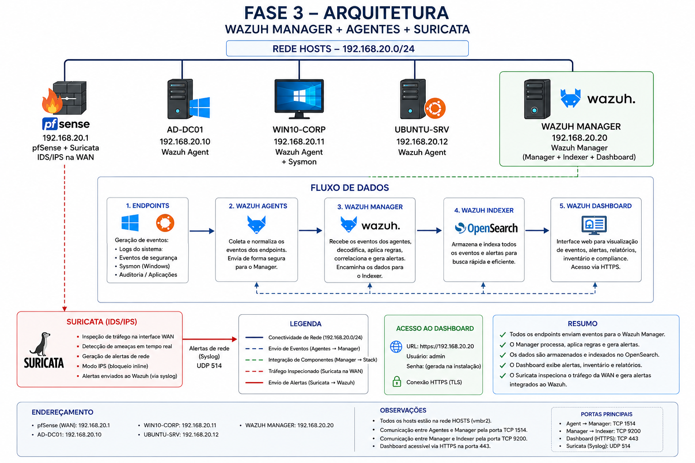
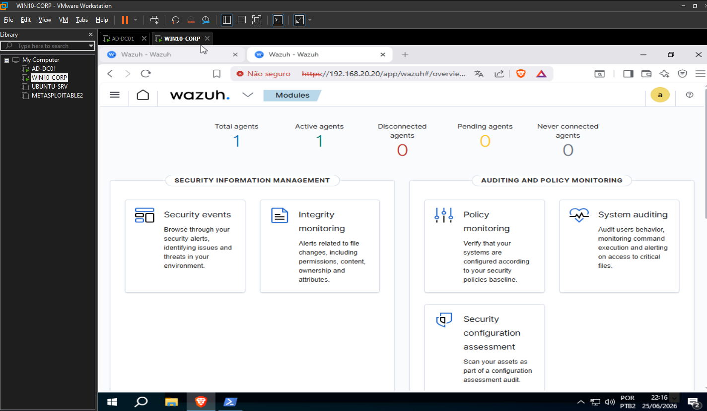
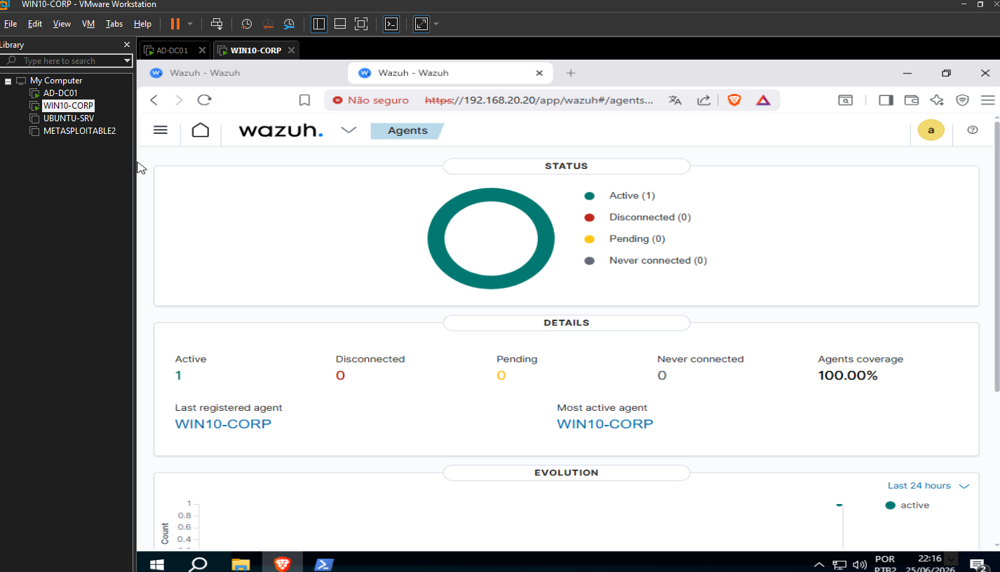
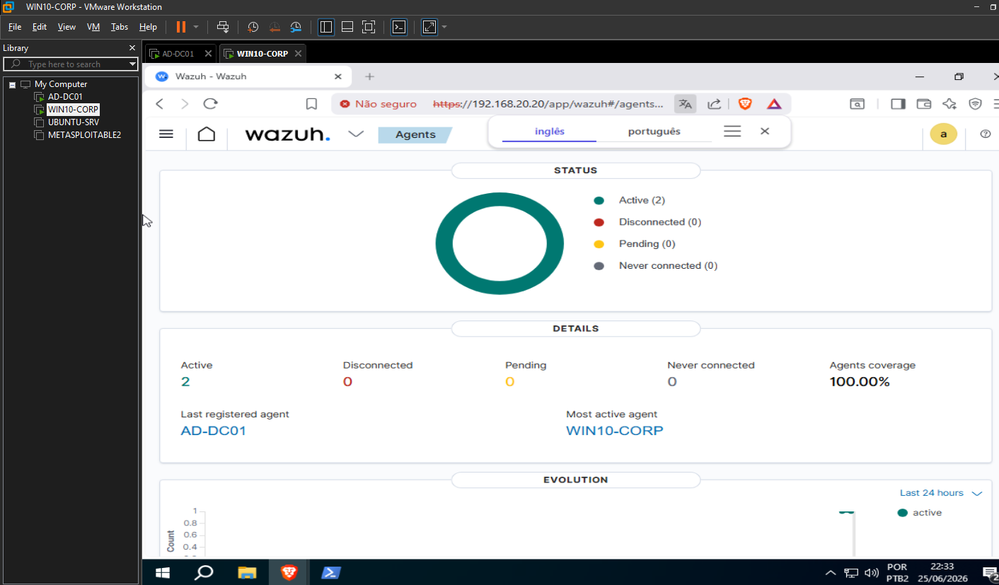
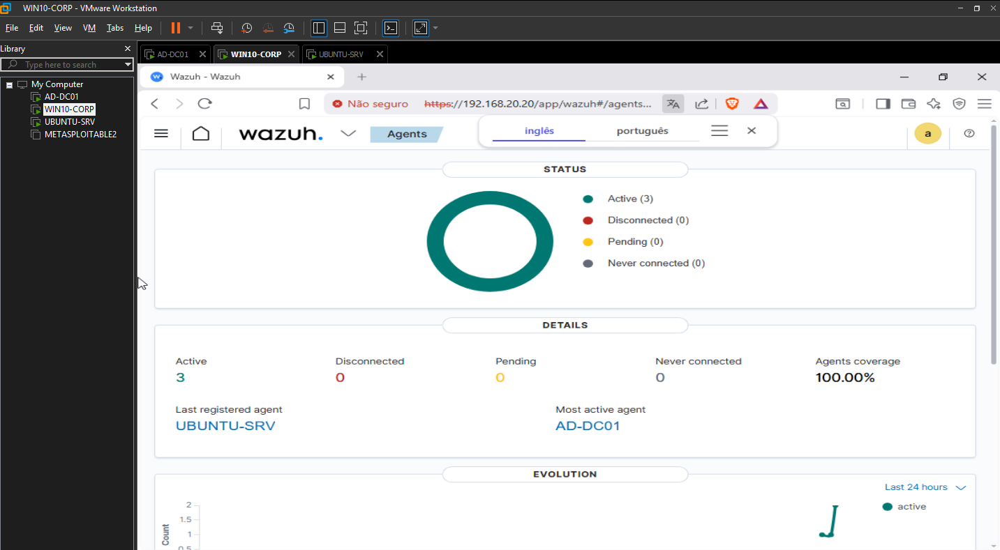
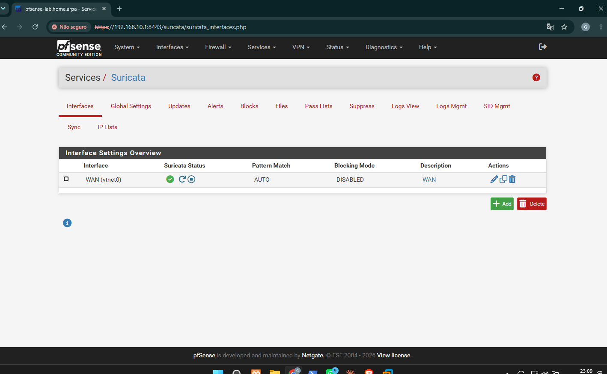
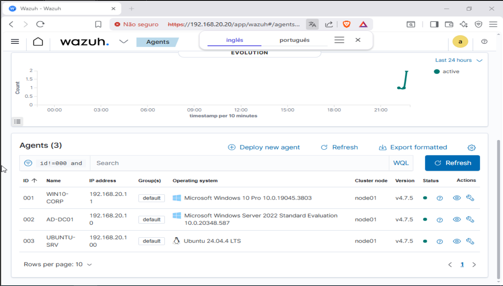

# Fase 3 — Wazuh Manager + Agentes + Suricata

> **Status:** ✅ Concluída  
> **Hardware:** PC Secundário (Proxmox VE) + PC Principal (VMware Workstation Pro)  
> **Objetivo:** Instalar o Wazuh Manager como SIEM/XDR, conectar agentes nos endpoints da empresa fictícia e ativar o Suricata como IDS/IPS no pfSense.

---

## Índice

1. [Arquitetura da Fase 3](#1-arquitetura-da-fase-3)
2. [Pré-requisitos](#2-pré-requisitos)
3. [VM Wazuh Manager — Ubuntu Server 22.04](#3-vm-wazuh-manager--ubuntu-server-2204)
4. [Instalação do Wazuh](#4-instalação-do-wazuh)
5. [Agente Wazuh — WIN10-CORP](#5-agente-wazuh--win10-corp)
6. [Agente Wazuh — AD-DC01](#6-agente-wazuh--ad-dc01)
7. [Agente Wazuh — UBUNTU-SRV](#7-agente-wazuh--ubuntu-srv)
8. [Suricata no pfSense](#8-suricata-no-pfsense)
9. [Validação final](#9-validação-final)
10. [Problemas encontrados e soluções](#10-problemas-encontrados-e-soluções)

---

## 1. Arquitetura da Fase 3



```
REDE HOSTS — 192.168.20.0/24
│
├── 192.168.20.1   pfSense + Suricata (IDS/IPS inline na WAN)
├── 192.168.20.20  Wazuh Manager (SIEM/XDR) ← novo
├── 192.168.20.10  AD-DC01      + Wazuh Agent ← novo
├── 192.168.20.11  WIN10-CORP   + Wazuh Agent + Sysmon ← novo
└── 192.168.20.12  UBUNTU-SRV   + Wazuh Agent ← novo
```

### Fluxo de dados

```
Endpoints (Sysmon/logs) → Wazuh Agents → Wazuh Manager (192.168.20.20)
                                               ↓
                                        Wazuh Indexer
                                               ↓
                                       Wazuh Dashboard
                                    https://192.168.20.20

Tráfego de rede → pfSense WAN → Suricata (alertas inline)
```

---

## 2. Pré-requisitos

- [ ] Proxmox acessível em `https://192.168.10.10:8006`
- [ ] pfSense acessível em `https://192.168.10.1:8443`
- [ ] ISO do **Ubuntu Server 22.04 LTS** disponível no Proxmox
- [ ] AD-DC01, WIN10-CORP e UBUNTU-SRV ligados e com conectividade na rede HOSTS

> ⚠️ **IMPORTANTE:** Use obrigatoriamente o **Ubuntu Server 22.04 LTS** para o Wazuh Manager. O Ubuntu 24.04 é incompatível com o Wazuh 4.7 e causa falhas no indexer (JVM crash, erros de log e inconsistência de banco de senhas). Essa foi a principal lição aprendida nesta fase.

---

## 3. VM Wazuh Manager — Ubuntu Server 22.04

### Criar a VM no Proxmox

1. Acesse `https://192.168.10.10:8006`.
2. Faça upload do ISO Ubuntu Server 22.04 em **local (pve) → ISO Images → Upload**.
3. **Criar VM** com as seguintes configurações:

| Campo | Valor |
|---|---|
| Nome | `wazuh-manager` |
| ISO | Ubuntu Server 22.04 LTS |
| Tipo | Linux |
| Disco | `100 GB` |
| CPU | `2 vCPUs` |
| RAM | `4096 MB` |
| Rede (net0) | `vmbr2` (HOSTS) — VirtIO |

4. Inicie a VM e abra o **Console**.

### Instalar o Ubuntu Server 22.04

1. **"Try or Install Ubuntu Server"** → Enter.
2. Language: **English** → Done.
3. Keyboard: **Portuguese (Brazil)** → Done.
4. Type: **Ubuntu Server** → Done.
5. Network: configure IP fixo diretamente na instalação:
   - Selecione `ens18` → **Edit IPv4 → Manual**
   - Subnet: `192.168.20.0/24`
   - Address: `192.168.20.20`
   - Gateway: `192.168.20.1`
   - Name servers: `192.168.20.10`
   - Search domains: `empresa.local`
6. Storage: **Use an entire disk** → Done → Continue.
7. Profile:
   - Server name: `wazuh-manager`
   - Username: `adminwazuh`
   - Password: `Homelab@2026`
8. Marque **Install OpenSSH server** ✅ → Done.
9. Featured snaps: nada → Done.
10. Aguarde e **Reboot Now**.
11. Remova o ISO: **Hardware → CD/DVD → "Não usar qualquer mídia"**.

### Ajuste de kernel obrigatório

```bash
sudo sysctl -w vm.max_map_count=262144
echo "vm.max_map_count=262144" | sudo tee -a /etc/sysctl.conf
```

---

## 4. Instalação do Wazuh

### Download dos scripts

```bash
curl -sO https://packages.wazuh.com/4.7/wazuh-install.sh
```

### Criar o arquivo config.yml

```bash
nano config.yml
```

Conteúdo:

```yaml
nodes:
  indexer:
    - name: node-1
      ip: "192.168.20.20"
  server:
    - name: wazuh-1
      ip: "192.168.20.20"
  dashboard:
    - name: dashboard
      ip: "192.168.20.20"
```

Confirme antes de continuar:

```bash
cat config.yml
```

### Instalação passo a passo

Execute um comando por vez e aguarde cada um terminar:

```bash
# 1. Gerar certificados e senhas
sudo bash wazuh-install.sh --generate-config-files --ignore-check

# 2. Instalar o indexer (OpenSearch)
sudo bash wazuh-install.sh --wazuh-indexer node-1 --ignore-check -o

# 3. Iniciar o cluster
sudo bash wazuh-install.sh --start-cluster --ignore-check

# 4. Instalar o server (Manager + Filebeat)
sudo bash wazuh-install.sh --wazuh-server wazuh-1 --ignore-check -o

# 5. Instalar o dashboard
sudo bash wazuh-install.sh --wazuh-dashboard dashboard --ignore-check -o
```

> ⚠️ A flag `-o` (overwrite) é necessária a partir do passo 2 para sobrescrever instalações anteriores em caso de reexecução.

> ⚠️ A flag `--ignore-check` é necessária porque o Wazuh 4.7 não tem suporte oficial ao Ubuntu 22.04 no script de verificação, mas funciona perfeitamente na prática.

### Credenciais geradas

Ao final do passo 5, o instalador exibe as credenciais. **Anote imediatamente:**

```bash
# Para consultar as credenciais depois:
sudo tar -axf wazuh-install-files.tar wazuh-install-files/wazuh-passwords.txt -O
```

| Usuário | Finalidade |
|---|---|
| `admin` | Login no dashboard web |
| `wazuh-wui` | Conexão API → Dashboard |
| `wazuh` | API interna |

### Acessar o dashboard

```
https://192.168.20.20
```

- User: `admin`
- Password: (gerada pelo instalador)



### Corrigir erro do indexer após restart

Se o indexer falhar após um restart com erro de JVM (`gc.log: No such file or directory`):

```bash
# Recriar pasta de log deletada durante reinstalação
sudo mkdir -p /var/log/wazuh-indexer
sudo chown wazuh-indexer:wazuh-indexer /var/log/wazuh-indexer

# Reaplicar vm.max_map_count
sudo sysctl -w vm.max_map_count=262144

# Iniciar o indexer
sudo systemctl start wazuh-indexer
```

---

## 5. Agente Wazuh — WIN10-CORP

1. No dashboard do Wazuh, clique em **"Add agent"**.
2. Preencha:
   - OS: **Windows**
   - Server address: `192.168.20.20`
   - Agent name: `WIN10-CORP`
3. Copie o comando PowerShell gerado.
4. No WIN10-CORP, abra o **PowerShell como Administrador**.
5. Cole e execute o comando.
6. Inicie o serviço:

```powershell
NET START WazuhSvc
```




---

## 6. Agente Wazuh — AD-DC01

1. No dashboard, clique em **"Add agent"**.
2. Preencha:
   - OS: **Windows**
   - Server address: `192.168.20.20`
   - Agent name: `AD-DC01`
3. Copie o comando PowerShell gerado.
4. No AD-DC01, abra o **PowerShell como Administrador**.
5. Cole e execute o comando.
6. Inicie o serviço:

```powershell
NET START WazuhSvc
```



---

## 7. Agente Wazuh — UBUNTU-SRV

1. No dashboard, clique em **"Add agent"**.
2. Preencha:
   - OS: **Linux**, distro: **Ubuntu**, arquitetura: **x86_64**
   - Server address: `192.168.20.20`
   - Agent name: `UBUNTU-SRV`
3. Copie o comando gerado (wget/curl + dpkg).
4. No Ubuntu Server, execute o comando.
5. Inicie o agente:

```bash
sudo systemctl daemon-reload
sudo systemctl enable wazuh-agent
sudo systemctl start wazuh-agent
```



---

## 8. Suricata no pfSense

### Instalar o pacote

1. Acesse `https://192.168.10.1:8443`.
2. **System → Package Manager → Available Packages**.
3. Pesquise `suricata` → **Install** → aguarde.

### Desabilitar Hardware Offloading (obrigatório)

O Suricata exige que 3 opções de hardware estejam desativadas:

1. **System → Advanced → Networking**.
2. Desmarque:
   - **Hardware Checksum Offloading** ✅
   - **Hardware TCP Segmentation Offloading** ✅
   - **Hardware Large Receive Offloading** ✅
3. Clique em **Save** e aguarde o pfSense reiniciar (~2 minutos).

### Configurar a interface WAN

1. **Services → Suricata → Interfaces → Add**.
2. Interface: `WAN` → **Save**.

### Habilitar regras ETOpen

1. **Services → Suricata → Global Settings**.
2. Marque **ETOpen Emerging Threats** ✅ (regras gratuitas de detecção).
3. **Save**.

### Atualizar regras e iniciar

1. **Services → Suricata → Updates → Update Rules**.
2. **Services → Suricata → Interfaces** → clique em **▶ (Play)** ao lado da WAN.
3. Confirme que o status ficou **verde**.



---

## 9. Validação final

No dashboard do Wazuh (`https://192.168.20.20`) → **Agents**:

| ID | Nome | IP | OS | Status |
|---|---|---|---|---|
| 001 | WIN10-CORP | 192.168.20.11 | Windows 10 Pro | ● Active |
| 002 | AD-DC01 | 192.168.20.10 | Windows Server 2022 | ● Active |
| 003 | UBUNTU-SRV | 192.168.20.12 | Ubuntu 24.04 LTS | ● Active |



---

## 10. Problemas encontrados e soluções

| Etapa | Problema | Causa | Solução |
|---|---|---|---|
| Instalação Wazuh | Erro `--ignore-check` obrigatório | Wazuh 4.7 não reconhece Ubuntu como SO suportado no script de verificação | Adicionar `--ignore-check` em todos os comandos de instalação |
| Instalação Wazuh | `No such file or directory` no script de instalação | ISO baixado no Ubuntu 24.04 — script incompatível com a versão | Recriar a VM usando **Ubuntu Server 22.04 LTS** |
| Wazuh indexer | Falha de JVM: `Error opening log file gc.log` | Pasta `/var/log/wazuh-indexer/` deletada durante reinstalação | `sudo mkdir -p /var/log/wazuh-indexer && sudo chown wazuh-indexer:wazuh-indexer /var/log/wazuh-indexer` |
| Wazuh indexer | `vm.max_map_count` perdido após restart | Configuração aplicada apenas em memória (`sysctl -w`), não persistida | Adicionar `vm.max_map_count=262144` no `/etc/sysctl.conf` |
| Wazuh dashboard | `[API connection] No API available — Invalid credentials` | Inconsistência entre senhas do indexer e da API causada pela primeira instalação com config.yml vazio | Recriar o banco da API: `sudo mv /var/ossec/api/configuration/security/rbac.db /var/ossec/api/configuration/security/rbac.db.bak` e reiniciar o wazuh-manager |
| Wazuh dashboard | `Internal Server Error 500` | Indexer parado enquanto dashboard tentava conectar | Garantir que o indexer está rodando antes do dashboard: `sudo systemctl start wazuh-indexer && sleep 30 && sudo systemctl restart wazuh-dashboard` |
| Suricata | Aviso de Hardware Offloading ativo | pfSense com Checksum/TCP Segmentation/Large Receive Offloading habilitados | System → Advanced → Networking → desmarcar as 3 opções de offloading → Save → aguardar reboot |
| config.yml | Arquivo consumido pelo `--generate-config-files` | O script usa e remove o config.yml para gerar o tar de certificados | Sempre criar o config.yml imediatamente antes de rodar `--generate-config-files`, nunca antes |

---

➡️ Próxima fase: **[Fase 4 — n8n + File Server + VPN]**
