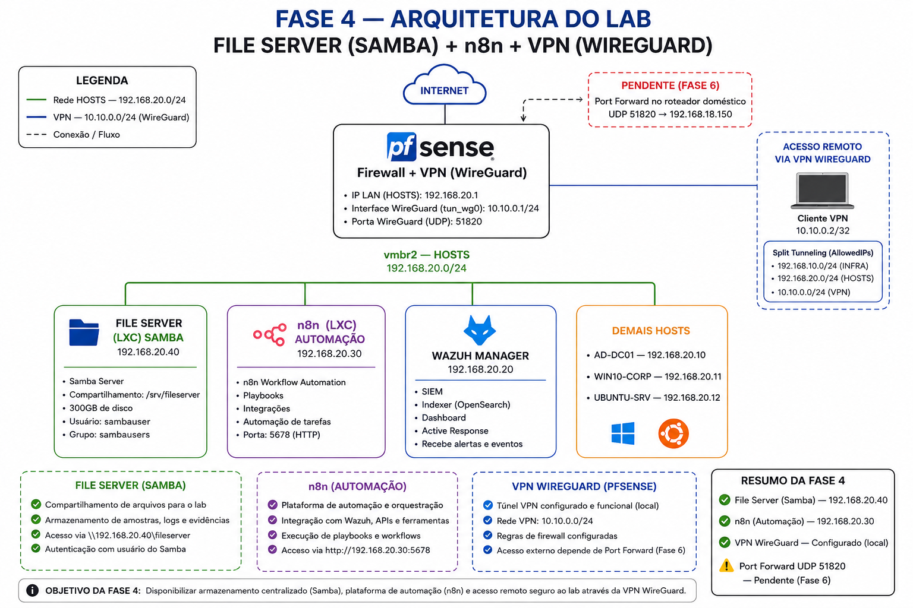
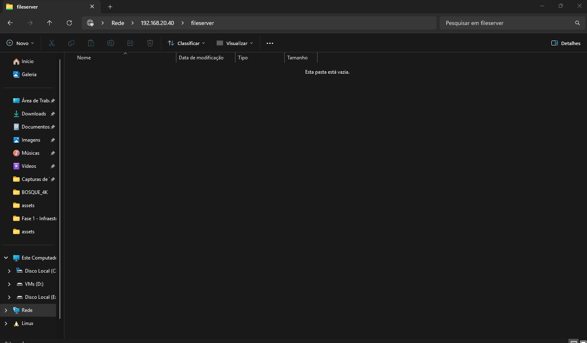
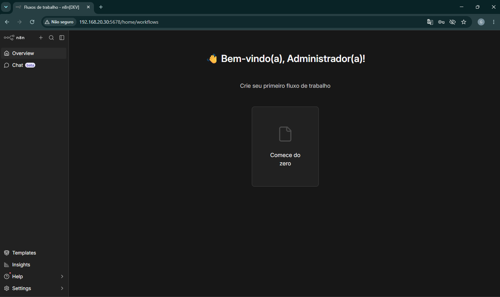

# Fase 4 — File Server (Samba) + n8n + VPN (WireGuard)

> **Status:** ✅ Concluída (WireGuard pendente de Port Forward no roteador doméstico — ver Fase 6)
> **Hardware:** PC Secundário (Proxmox VE)
> **Objetivo:** Instalar o servidor de arquivos com Samba (300GB), o n8n para automação de playbooks e configurar a VPN WireGuard para acesso remoto seguro ao lab.

---

## Índice

1. [Arquitetura da Fase 4](#1-arquitetura-da-fase-4)
2. [LXC File Server — Samba](#2-lxc-file-server--samba)
3. [LXC n8n — Automação](#3-lxc-n8n--automação)
4. [VPN WireGuard — pfSense](#4-vpn-wireguard--pfsense)
5. [Problemas encontrados e soluções](#5-problemas-encontrados-e-soluções)

---

## 1. Arquitetura da Fase 4


```
REDE HOSTS — 192.168.20.0/24
│
├── 192.168.20.1   pfSense + WireGuard (VPN — porta UDP 51820)
├── 192.168.20.20  Wazuh Manager
├── 192.168.20.30  n8n (LXC — automação e playbooks)     ← novo
├── 192.168.20.40  File Server (LXC — Samba 300GB)       ← novo
├── 192.168.20.10  AD-DC01
├── 192.168.20.11  WIN10-CORP
└── 192.168.20.12  UBUNTU-SRV
```

### Template LXC utilizado

Todos os LXCs desta fase usam o template **ubuntu-22.04-standard**, baixado em:
**local (pve) → CT Templates → Templates → ubuntu-22.04-standard → Download**

---

## 2. LXC File Server — Samba

### Criar o LXC

**Proxmox → Criar CT:**

| Campo | Valor |
|---|---|
| CT ID | `102` |
| Hostname | `fileserver` |
| Password | `<password>` |
| Template | `ubuntu-22.04-standard` |
| Disco | `310 GB` |
| CPU | `2 cores` |
| Memória | `1024 MB` |
| Swap | `512 MB` |
| Bridge | `vmbr2` (HOSTS) |
| IPv4 | `192.168.20.40/24` (Static) |
| Gateway | `192.168.20.1` |
| DNS | `8.8.8.8` |

Antes de iniciar: **Opções → Nesting → Habilitado**.

### Instalar o Samba

```bash
# Corrigir DNS se necessário
echo "nameserver 8.8.8.8" > /etc/resolv.conf

# Atualizar e instalar
apt update && apt upgrade -y
apt install samba -y

# Criar pasta de compartilhamento
mkdir -p /srv/fileserver
chmod 777 /srv/fileserver
```

### Configurar o Samba

```bash
cp /etc/samba/smb.conf /etc/samba/smb.conf.bak
nano /etc/samba/smb.conf
```

Conteúdo:

```ini
[global]
   workgroup = EMPRESA
   server string = File Server
   netbios name = fileserver
   security = user
   map to guest = bad user
   dns proxy = no

[fileserver]
   path = /srv/fileserver
   browseable = yes
   writable = yes
   guest ok = no
   valid users = @sambausers
   create mask = 0660
   directory mask = 0771
   force group = sambausers
```

### Criar usuário de acesso

```bash
groupadd sambausers
useradd -M -s /sbin/nologin sambauser
usermod -aG sambausers sambauser
smbpasswd -a sambauser
chown root:sambausers /srv/fileserver
systemctl restart smbd nmbd
systemctl enable smbd nmbd
```

Senha do usuário Samba: `<password>`

### Acessar pelo Windows

No Explorador de Arquivos:
```
\\192.168.20.40\fileserver
```

- Usuário: `sambauser`
- Senha: `<password>`


---

## 3. LXC n8n — Automação

### Criar o LXC

**Proxmox → Criar CT:**

| Campo | Valor |
|---|---|
| CT ID | `103` |
| Hostname | `n8n` |
| Password | `<password> |
| Template | `ubuntu-22.04-standard` |
| Disco | `20 GB` |
| CPU | `2 cores` |
| Memória | `2048 MB` |
| Swap | `512 MB` |
| Bridge | `vmbr2` (HOSTS) |
| IPv4 | `192.168.20.30/24` (Static) |
| Gateway | `192.168.20.1` |
| DNS | `8.8.8.8` |

### Instalar o n8n

```bash
# Corrigir DNS se necessário
echo "nameserver 8.8.8.8" > /etc/resolv.conf

# Atualizar sistema
apt update && apt upgrade -y

# Instalar dependências
apt install curl -y

# Instalar Node.js 20
curl -fsSL https://deb.nodesource.com/setup_20.x | bash -
apt install nodejs -y

# Confirmar versão (deve ser v20.x.x)
node -v
npm -v

# Instalar n8n
npm install -g n8n
```

### Criar serviço systemd

```bash
nano /etc/systemd/system/n8n.service
```

Conteúdo:

```ini
[Unit]
Description=n8n workflow automation
After=network.target

[Service]
Type=simple
User=root
Environment=N8N_HOST=0.0.0.0
Environment=N8N_PORT=5678
Environment=N8N_PROTOCOL=http
Environment=NODE_ENV=production
Environment=WEBHOOK_URL=http://192.168.20.30:5678/
Environment=N8N_SECURE_COOKIE=false
ExecStart=/usr/bin/n8n start
Restart=on-failure

[Install]
WantedBy=multi-user.target
```

```bash
systemctl daemon-reload
systemctl enable n8n
systemctl start n8n
```

### Acessar o n8n

```
http://192.168.20.30:5678
```

Credenciais iniciais:
- Email: `admin@empresa.local`
- Nome: `Admin`
- Senha: `<password>`



---

## 4. VPN WireGuard — pfSense

> ⚠️ **Status:** Parcialmente configurado. O túnel e as regras estão corretos, mas o acesso externo depende de **Port Forward no roteador doméstico** (porta UDP 51820 → `192.168.18.150`). Será finalizado na **Fase 6** quando o acesso ao roteador estiver disponível.

### Instalar o pacote

**System → Package Manager → Available Packages → wireguard → Install**

### Configurar o túnel

**VPN → WireGuard → Settings → Enable WireGuard** ✅ → Save

**VPN → WireGuard → Tunnels → Add Tunnel:**

| Campo | Valor |
|---|---|
| Description | `VPN-LAB` |
| Listen Port | `51820` |
| Interface Keys | Clicar em **Generate** |
| Address | `10.10.0.1/24` |

### Criar interface

**Interfaces → Assignments → selecionar `tun_wg0` → Add:**
- Enable ✅
- Description: `VPN`
- IPv4 Static: `10.10.0.1/24`

### Gerar chaves do cliente

Na VM do Wazuh Manager:

```bash
apt install wireguard-tools -y
cd /tmp
wg genkey | tee vpn-cliente-privada.key | wg pubkey > vpn-cliente-publica.key
cat vpn-cliente-publica.key | tr -d '\n'
```

### Adicionar Peer

**VPN → WireGuard → Peers → Add Peer:**

| Campo | Valor |
|---|---|
| Tunnel | `tun_wg0` |
| Description | `cliente-1` |
| Public Key | (chave pública do cliente) |
| Allowed IPs | `10.10.0.2/32` |

### Regras de firewall

**Firewall → Rules → aba WireGuard → Add:**
- Action: `Pass`, Protocol: `Any`, Source: `Any`, Destination: `Any`
- Description: `WireGuard tráfego VPN`

**Firewall → Rules → aba WAN → Add:**
- Action: `Pass`, Protocol: `UDP`
- Destination: `WAN address`, Port: `51820`
- Description: `WireGuard entrada`

**Firewall → Rules → aba VPN → Add:**
- Action: `Pass`, Protocol: `Any`
- Source: `VPN net`, Destination: `Any`
- Description: `VPN acesso lab`

### Arquivo de configuração do cliente

```ini
[Interface]
PrivateKey = (chave privada do cliente)
Address = 10.10.0.2/32
DNS = 8.8.8.8

[Peer]
PublicKey = (chave pública do servidor pfSense)
Endpoint = (IP_PUBLICO_DO_ROTEADOR):51820
AllowedIPs = 192.168.10.0/24, 192.168.20.0/24, 10.10.0.0/24
PersistentKeepalive = 25
```

> **Split tunneling:** o `AllowedIPs` foi configurado para rotear **apenas** o tráfego das redes do lab pela VPN. O tráfego de internet normal continua saindo direto, sem passar pelo túnel.

### Pendente para Fase 6

- [ ] Configurar Port Forward no roteador doméstico: `UDP 51820 → 192.168.18.150`
- [ ] Testar acesso externo via 4G com handshake estabelecido
- [ ] Gerar QR code para configuração rápida no celular

---

## 5. Problemas encontrados e soluções

| Etapa | Problema | Causa | Solução |
|---|---|---|---|
| LXC File Server | `apt update` sem internet — `Failed to connect` | DNS apontando para AD-DC01 (`192.168.20.10`) que não resolve nomes externos | Adicionar `nameserver 8.8.8.8` no `/etc/resolv.conf` do LXC |
| LXC n8n | Node.js e curl não instalados por padrão | Template LXC mínimo sem ferramentas extras | `apt install curl -y` antes de instalar o Node.js |
| LXC n8n | `npm install -g n8n` falhou com `SyntaxError` | Node.js v12 instalado (muito antigo) | Remover versão antiga e instalar Node.js 20 via `nodesource` |
| LXC n8n | n8n iniciando mas exibindo erro de cookie seguro | n8n por padrão exige HTTPS para cookies seguros | Adicionar `Environment=N8N_SECURE_COOKIE=false` no serviço systemd |
| WireGuard | `Latest Handshake: never` — sem conexão | Falta de Port Forward no roteador doméstico + aba WireGuard sem regras de firewall | Adicionada regra na aba WireGuard; Port Forward pendente de acesso ao roteador |
| WireGuard | VPN ativa bloqueava toda a internet | `AllowedIPs = 0.0.0.0/0` redirecionando todo o tráfego | Corrigido para split tunneling: `AllowedIPs = 192.168.10.0/24, 192.168.20.0/24, 10.10.0.0/24` |

---

➡️ Próxima fase: **Fase 5 — DVR Hikvision**
