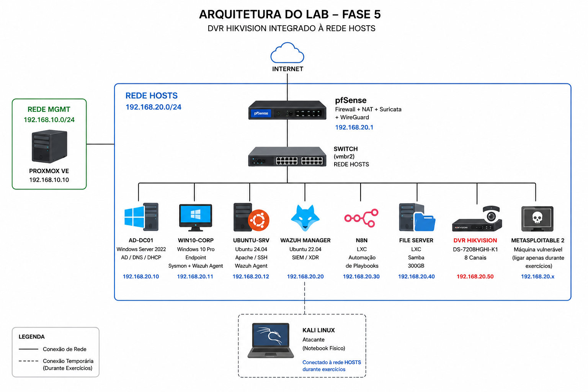
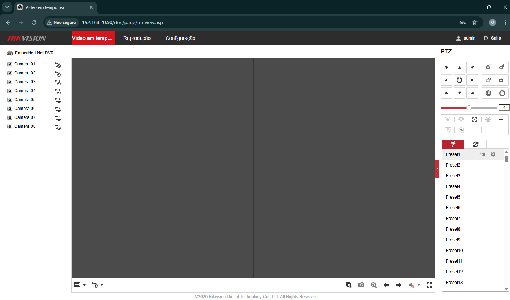
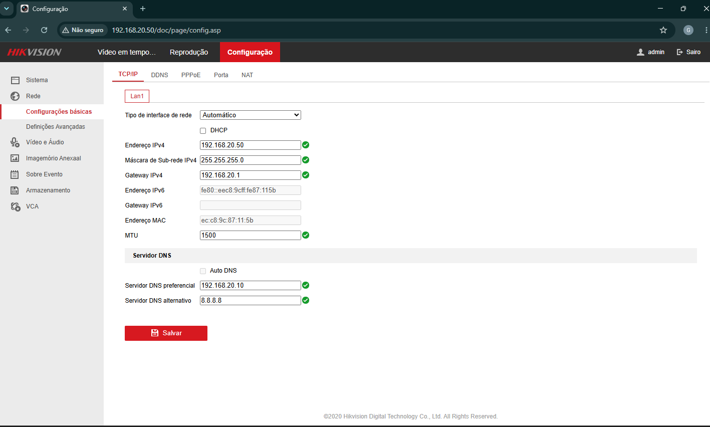

# Fase 5 — DVR Hikvision DS-7208HGHI-K1

> **Status:** ✅ Concluída (DVR conectado e acessível na rede HOSTS)  
> **Hardware:** DVR Hikvision DS-7208HGHI-K1/CVBS — 8 canais  
> **Objetivo:** Integrar o DVR Hikvision na rede HOSTS como alvo de estudos de segurança em dispositivos IoT/CFTV, incluindo exploração de CVEs reais e movimentação lateral.

---
## Arquitetura da Fase



## Índice

1. [Sobre o dispositivo](#1-sobre-o-dispositivo)
2. [Vulnerabilidades conhecidas](#2-vulnerabilidades-conhecidas)
3. [Conectar o DVR na rede HOSTS](#3-conectar-o-dvr-na-rede-hosts)
4. [Validação do acesso](#4-validação-do-acesso)
5. [Próximos passos — Exploração (Fase 6+)](#5-próximos-passos--exploração-fase-6)

---

## 1. Sobre o dispositivo

| Campo | Valor |
|---|---|
| Modelo | DS-7208HGHI-K1/CVBS |
| Serial Number | F21127482 |
| Fabricante | Hikvision |
| Canais | 8 |
| IP na rede HOSTS | `192.168.20.50` |
| Interface web | `http://192.168.20.50` |
| Usuário padrão | `admin` |
| Firmware copyright | 2020 Hikvision Digital Technology |

---

## 2. Vulnerabilidades conhecidas

O modelo DS-7208HGHI-K1 é afetado por CVEs críticos amplamente documentados e com exploits públicos disponíveis:

| CVE | CVSS | Tipo | Autenticação | Impacto |
|---|---|---|---|---|
| **CVE-2021-36260** | 9.8 (Crítico) | Command Injection / RCE | Não necessária | Root shell remoto no dispositivo |
| **CVE-2017-7921** | 8.8 (Alto) | Auth Bypass / Backdoor | Não necessária | Acesso a configurações, senhas e streams |

### CVE-2021-36260 — Command Injection (RCE)

Injeção de comando no servidor web do DVR. Um atacante envia uma requisição HTTP maliciosa e executa comandos arbitrários como **root** sem precisar de credenciais. Listado no catálogo **CISA Known Exploited Vulnerabilities**.

> Afeta firmware com versão anterior a `210628`. Dispositivos sem atualização de firmware são vulneráveis.

### CVE-2017-7921 — Backdoor de Autenticação

Chave de autenticação hardcoded (`auth=YWRtaW46MTEK`) deixada pela Hikvision permite acesso direto a arquivos de configuração (com senhas em texto claro), snapshots de câmeras e lista de usuários — sem nenhuma credencial.

> Esses CVEs serão explorados nos laboratórios de Red Team (ver `labs/redteam/`).

---

## 3. Conectar o DVR na rede HOSTS

### Cabeamento físico

1. Conecta o cabo de rede do DVR no switch da rede **HOSTS** (`vmbr2`).
2. Liga o DVR.

### Configuração de IP

No menu do DVR (pelo monitor conectado):

**Menu → Configuração → Rede → TCP/IP**

| Campo | Valor |
|---|---|
| Tipo | Estático (desmarcar DHCP) |
| Endereço IPv4 | `192.168.20.50` |
| Máscara de Sub-rede | `255.255.255.0` |
| Gateway | `192.168.20.1` |
| DNS Preferencial | `192.168.20.10` |
| DNS Alternativo | `8.8.8.8` |

Clica em **Salvar**.

---

## 4. Validação do acesso

Do PC Principal, acessa no navegador:

```
http://192.168.20.50
```
### Interface Web do DVR



### Configuração de Rede



---

## 5. Próximos passos — Exploração (Fase 6+)

A exploração dos CVEs do DVR foi postergada para as fases de laboratório (Red Team), onde cada ataque será executado, documentado e mapeado ao framework MITRE ATT&CK:

### Red Team — CVE-2021-36260

```
Reconhecimento → Exploração (RCE sem autenticação) → Acesso root → Reverse shell → Pivoting
```

| Tática MITRE | Técnica | ID |
|---|---|---|
| Initial Access | Exploit Public-Facing Application | T1190 |
| Execution | Command and Scripting Interpreter | T1059 |
| Lateral Movement | Exploitation of Remote Services | T1210 |

### Red Team — CVE-2017-7921

```
Reconhecimento → Auth bypass → Exfiltração de credenciais → Acesso a streams de câmera
```

| Tática MITRE | Técnica | ID |
|---|---|---|
| Initial Access | Exploit Public-Facing Application | T1190 |
| Credential Access | Credentials from Password Stores | T1555 |
| Collection | Video Capture | T1125 |

### Blue Team — Detecção

- Alertas do **Suricata** para requisições HTTP maliciosas
- Correlação no **Wazuh** com movimentação lateral
- Automação de resposta via **n8n**

> Ver laboratórios completos em `labs/redteam/` e `labs/blueteam/`


## Resumo do ambiente após Fase 5

```
REDE HOSTS — 192.168.20.0/24
│
├── 192.168.20.1   pfSense (Firewall + NAT + Suricata + WireGuard)
├── 192.168.20.10  AD-DC01 (Windows Server 2022 — AD/DNS/DHCP)
├── 192.168.20.11  WIN10-CORP (Windows 10 Pro — endpoint + Sysmon + Wazuh Agent)
├── 192.168.20.12  UBUNTU-SRV (Ubuntu 24.04 — Apache/SSH + Wazuh Agent)
├── 192.168.20.20  Wazuh Manager (Ubuntu 22.04 — SIEM/XDR)
├── 192.168.20.30  n8n (LXC — automação de playbooks)
├── 192.168.20.40  File Server (LXC — Samba 300GB)
├── 192.168.20.50  DVR Hikvision DS-7208HGHI-K1 ← adicionado nesta fase
└── 192.168.20.x   Metasploitable 2 (alvo de pentest — ligar só durante exercícios)

REDE MGMT — 192.168.10.0/24
└── 192.168.10.10  Proxmox VE (hypervisor)

ATACANTE
└── Kali Linux (notebook físico — conectado na rede HOSTS durante exercícios)
```

---

➡️ Próximo: **Labs de Red Team e Blue Team**  
➡️ Pendente: **Fase 6 — WireGuard (Port Forward) + Exploração DVR**
